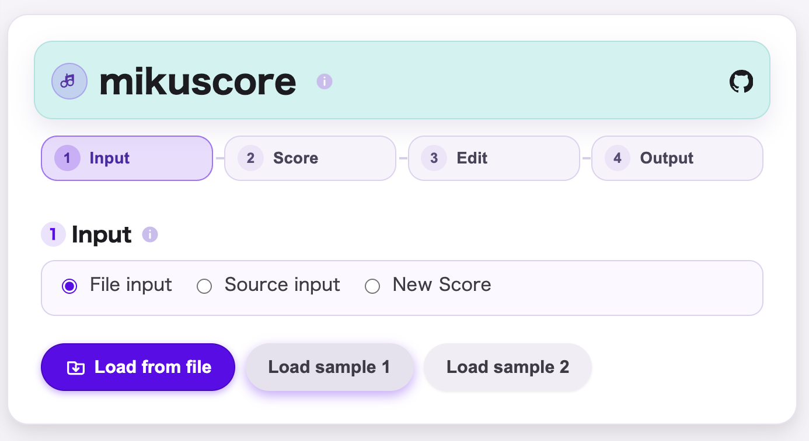
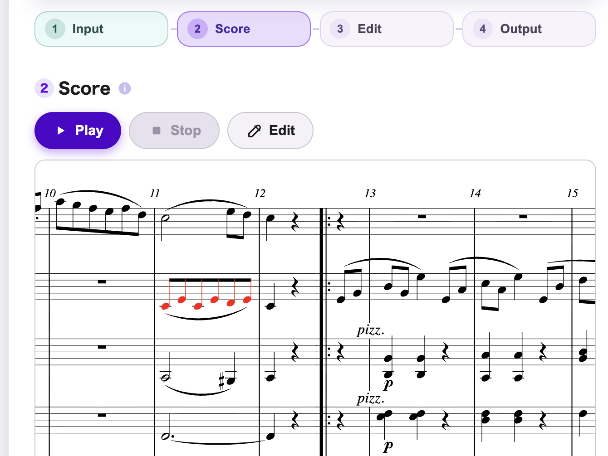
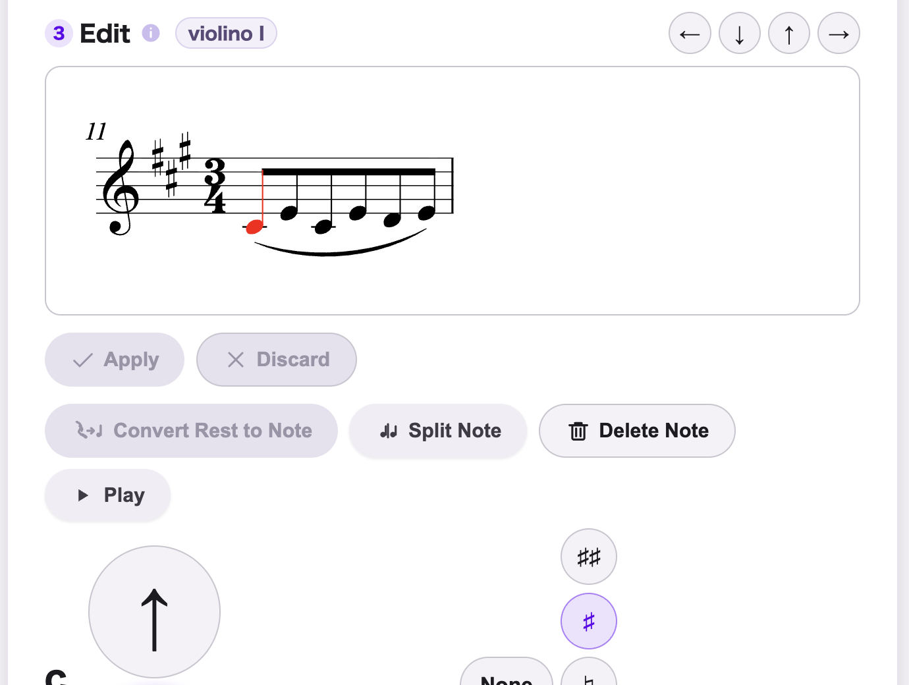
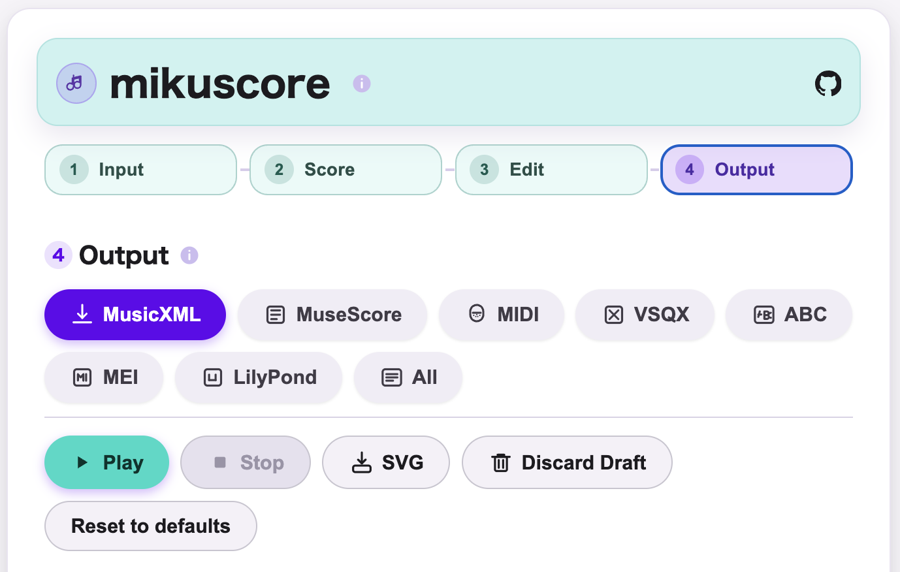

# mikuscore

## Language Policy
- English text is the normative source unless explicitly noted otherwise.
- Japanese sections are abridged translations for readability.
- Exception: for undecided points or in-progress notes, Japanese-only entries MAY be used temporarily.

## English
mikuscore is a browser-based **score format converter** centered on MusicXML.
It is delivered as a **single-file web app** (`mikuscore.html`) and runs offline.

### Screenshots

### What makes mikuscore different
- MusicXML-first conversion pipeline
- Preserve existing MusicXML as much as possible
- Keep conversion losses visible via diagnostics / metadata
- No installation required (single HTML, browser only)

### Scope
- Primary: format conversion and round-trip stability
- Secondary: lightweight notation editing and preview
- Not a feature-complete score engraving editor

### Supported formats
- MusicXML (`.musicxml` / `.xml` / `.mxl`) (MusicXML 4.0 core baseline)
- MuseScore (`.mscx` / `.mscz`)
- MIDI (`.mid` / `.midi`)
- VSQX (`.vsqx`) (via vendored `utaformatix3-ts-plus`)
- ABC (`.abc`) (ABC standard 2.2 baseline; some standard features remain partially implemented or unimplemented)
- MEI (`.mei`) (experimental)
- LilyPond (`.ly`) (experimental)

### Build and local development
- `npm run build`
- `npm run test:build`
- `npm run test:integration`
- `npm run check:all`
- `npm run clean`
- `npm run typecheck`
- `npm run test:unit`
- `npm run test:property`
- `npm run test:all`
- `npm run build:vendor:utaformatix3`

### CLI
- Current CLI uses a `convert`-first command surface.
- Available commands:
  - `mikuscore convert --from abc --to musicxml`
  - `mikuscore convert --from musicxml --to abc`
  - `mikuscore convert --from midi --to musicxml`
  - `mikuscore convert --from musicxml --to midi`
  - `mikuscore convert --from musescore --to musicxml`
  - `mikuscore convert --from musicxml --to musescore`
  - `mikuscore render svg`
  - `mikuscore convert --help`
  - `mikuscore render --help`
  - `mikuscore --help`
- Input/output contract:
  - `--from <format>` selects source format
  - `--to <format>` selects target format
  - `--in <file>` reads from file
  - omitted `--in` reads from `stdin`
  - `--out <file>` writes to file
  - omitted `--out` writes to `stdout`
  - text conversions use text input/output
  - MIDI input/output uses binary input/output
  - current MuseScore CLI scope is `.mscx`-style text, not compressed `.mscz`

Examples:
- `npm run cli -- --help`
- `npm run cli -- convert --help`
- `npm run cli -- convert --from abc --to musicxml --in score.abc --out score.musicxml`
- `npm run cli -- convert --from musicxml --to abc --in score.musicxml --out score.abc`
- `npm run cli -- convert --from midi --to musicxml --in score.mid --out score.musicxml`
- `npm run cli -- convert --from musicxml --to midi --in score.musicxml --out score.mid`
- `npm run cli -- convert --from musescore --to musicxml --in score.mscx --out score.musicxml`
- `npm run cli -- convert --from musicxml --to musescore --in score.musicxml --out score.mscx`
- `npm run cli -- render svg --in score.musicxml --out score.svg`
- `cat score.abc | npm run cli -- convert --from abc --to musicxml`

Practical command split:
- `npm run build`: faster day-to-day build (`typecheck` + `test:build` + `build:dist`)
- `build:dist` reuses incremental TypeScript cache and skips unchanged generated sample/prompt sources when possible
- `npm run test:build`: build-gating unit tests without the heaviest integration-style suites
- `npm run test:property`: property tests kept outside the day-to-day build gate
- `npm run test:integration`: heavy integration-style suites (`cffp-series`, `mei-io`, `musescore-io`)
- `npm run check:all`: full verification (`typecheck` + full `test:all` + `build:dist`)

### Documentation map
- Contribution and repository policy docs:
  - `CODE_OF_CONDUCT.md`
  - `CONTRIBUTING.md`
  - `CONTRIBUTORS.md`
  - `THIRD-PARTY-NOTICES.md`
- Product docs (positioning / policy / coverage / quality):
  - `docs/PRODUCT_POSITIONING.md`
  - `docs/CONVERSION_PRINCIPLES.md`
  - `docs/FORMAT_COVERAGE.md`
  - `docs/QUALITY.md`
  - `docs/AI_INTERACTION_POLICY.md`
- Specification docs (`docs/spec/*`) are normative implementation specs:
  - `docs/spec/SPEC.md`
  - `docs/spec/ARCHITECTURE.md`
  - `docs/spec/DIAGNOSTICS.md`
  - `docs/spec/MUSESCORE_IO.md`
  - `docs/spec/MIDI_IO.md`
  - `docs/spec/ABC_IO.md`
  - `docs/spec/CLI_STEP1.md`
  - `docs/spec/TEST_MATRIX.md`
  - `docs/future/AI_JSON_INTERFACE.md` (deferred future work note for a possible AI-facing JSON interface)
  - `docs/future/CLI_ROADMAP.md` (future note for CLI Step 2 / Step 3 expansion)

### AI interaction policy (transition phase)
- Canonical score source remains MusicXML.
- For generative-AI interaction, full-score handoff and new-score generation are currently centered on ABC.
- Current generative-AI handoff is centered on ABC.
- A dedicated AI-facing JSON interface is deferred future work, not part of the current product contract.
- See `docs/AI_INTERACTION_POLICY.md` for the current policy and `docs/future/AI_JSON_INTERFACE.md` for the deferred JSON note.

Debugging note:
- For import-side incident analysis, check `docs/spec/MIDI_IO.md` and `docs/spec/ABC_IO.md` sections about `attributes > miscellaneous > miscellaneous-field` (`mks:*` debug fields).

---

## 日本語
mikuscore は、MusicXML を中核に据えた **譜面フォーマット変換ソフト** です。  
配布形態は **単一 HTML**（`mikuscore.html`）で、ブラウザのみでオフライン動作します。

### スクリーンショット

### mikuscore の特徴
- MusicXML-first の変換パイプライン
- 既存 MusicXML を極力壊さない
- 変換で生じた欠落を診断情報・メタデータで追跡可能
- インストール不要（単一 HTML、ブラウザのみ）

### スコープ
- 主機能: フォーマット変換と round-trip 安定性
- 副機能: 軽量な譜面編集とプレビュー
- 多機能な浄書エディタの代替を目指すものではない

### 対応フォーマット
- MusicXML（`.musicxml` / `.xml` / `.mxl`）（MusicXML 4.0 基準フォーマット）
- MuseScore（`.mscx` / `.mscz`）
- MIDI（`.mid` / `.midi`）
- VSQX（`.vsqx`）（同梱 `utaformatix3-ts-plus` 経由）
- ABC（`.abc`）（ABC standard 2.2 ベース。一部の標準機能は未実装または部分対応）
- MEI（`.mei`）（実験的対応）
- LilyPond（`.ly`）（実験的対応）

### ビルドとローカル開発
- `npm run build`
- `npm run test:build`
- `npm run test:integration`
- `npm run check:all`
- `npm run clean`
- `npm run typecheck`
- `npm run test:unit`
- `npm run test:property`
- `npm run test:all`
- `npm run build:vendor:utaformatix3`

### CLI
- 現在の CLI は `convert` 中心のコマンド体系です。
- 利用可能コマンド:
  - `mikuscore convert --from abc --to musicxml`
  - `mikuscore convert --from musicxml --to abc`
  - `mikuscore convert --from midi --to musicxml`
  - `mikuscore convert --from musicxml --to midi`
  - `mikuscore convert --from musescore --to musicxml`
  - `mikuscore convert --from musicxml --to musescore`
  - `mikuscore render svg`
  - `mikuscore convert --help`
  - `mikuscore render --help`
  - `mikuscore --help`
- 入出力契約:
  - `--from <format>` で入力形式を指定
  - `--to <format>` で出力形式を指定
  - `--in <file>` でファイル入力
  - `--in` 省略時は `stdin`
  - `--out <file>` でファイル出力
  - `--out` 省略時は `stdout`
  - text 変換は text 入出力
  - MIDI 入出力は binary 入出力
  - 現在の MuseScore CLI は `.mscx` 相当の text を対象とし、圧縮 `.mscz` はまだ対象外

例:
- `npm run cli -- --help`
- `npm run cli -- convert --help`
- `npm run cli -- convert --from abc --to musicxml --in score.abc --out score.musicxml`
- `npm run cli -- convert --from musicxml --to abc --in score.musicxml --out score.abc`
- `npm run cli -- convert --from midi --to musicxml --in score.mid --out score.musicxml`
- `npm run cli -- convert --from musicxml --to midi --in score.musicxml --out score.mid`
- `npm run cli -- convert --from musescore --to musicxml --in score.mscx --out score.musicxml`
- `npm run cli -- convert --from musicxml --to musescore --in score.musicxml --out score.mscx`
- `npm run cli -- render svg --in score.musicxml --out score.svg`
- `cat score.abc | npm run cli -- convert --from abc --to musicxml`

実用的なコマンド分割:
- `npm run build`: 日常用の比較的速いビルド（`typecheck` + `test:build` + `build:dist`）
- `build:dist` は incremental な TypeScript キャッシュを再利用し、未変更の生成 sample / prompt 同期を可能な範囲で省略
- `npm run test:build`: ビルドゲート用 unit テスト（最重量の統合寄り suite は除外）
- `npm run test:property`: property テスト（日常 build gate の外に維持）
- `npm run test:integration`: 重い統合寄り suite（`cffp-series`, `mei-io`, `musescore-io`）
- `npm run check:all`: フル検証（`typecheck` + full `test:all` + `build:dist`）

### ドキュメントマップ
- コントリビューションとリポジトリ運用文書:
  - `CODE_OF_CONDUCT.md`
  - `CONTRIBUTING.md`
  - `CONTRIBUTORS.md`
  - `THIRD-PARTY-NOTICES.md`
- プロダクト文書（位置づけ / 方針 / 対応範囲 / 品質方針）:
  - `docs/PRODUCT_POSITIONING.md`
  - `docs/CONVERSION_PRINCIPLES.md`
  - `docs/FORMAT_COVERAGE.md`
  - `docs/QUALITY.md`
  - `docs/AI_INTERACTION_POLICY.md`
- 仕様文書（`docs/spec/*`）は実装規範:
  - `docs/spec/SPEC.md`
  - `docs/spec/ARCHITECTURE.md`
  - `docs/spec/DIAGNOSTICS.md`
  - `docs/spec/MUSESCORE_IO.md`
  - `docs/spec/MIDI_IO.md`
  - `docs/spec/ABC_IO.md`
  - `docs/spec/CLI_STEP1.md`
  - `docs/spec/TEST_MATRIX.md`
  - `docs/future/AI_JSON_INTERFACE.md`（生成AI向け JSON インタフェースの将来検討メモ）
  - `docs/future/CLI_ROADMAP.md`（CLI の STEP2 / STEP3 拡張メモ）

### 生成AI 連携方針（過渡期）
- 正本は引き続き MusicXML です。
- 生成AI とのやり取りでは、全体の受け渡しと新規譜面生成は現在 ABC を中心にします。
- 現在の生成AI 連携は ABC を中心にします。
- 生成AI向けの専用 JSON インタフェースは将来検討事項であり、現行プロダクト契約には含めません。
- 運用方針は `docs/AI_INTERACTION_POLICY.md`、将来検討メモは `docs/future/AI_JSON_INTERFACE.md` を参照してください。

デバッグメモ:
- インポート時の事象解析は `docs/spec/MIDI_IO.md` と `docs/spec/ABC_IO.md` の `attributes > miscellaneous > miscellaneous-field`（`mks:*` デバッグ項目）を参照してください。
